# DO2_Linux Network

# Part1. Инструмент ipcalc

## 1.1  Сети и маски

1) Найти адрес сети `192.167.38.54/13`.
   Для этого воспользуемся командой `ipcalc`

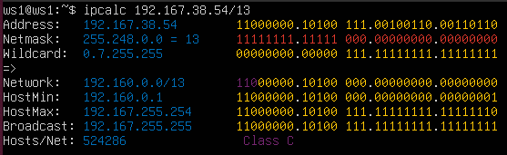

2) Перевести маски:

   1. 255.255.255.0 -> префикс `/24`, двоичный -- `11111111.11111111.11111111.00000000`
   2. Маска `/15` -> Обычная маска `255.254.255.240`, `11111111.11111110.00000000.00000000`
   3. Маска `Маска 11111111.11111111.11111111.11110000` -> `255.255.255.240`; `/28`
3) Минимальный и максимальный хост `12.167.38.4`

   1. `/8` -> Min: `12.0.0.1`; Max: `12.255.255.254`
      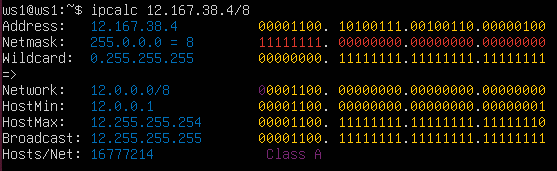
   2. `11111111.11111111.00000000.00000000 (= /16)` -> Min: `12.167.0.1`; Max: `12.167.255.254`
      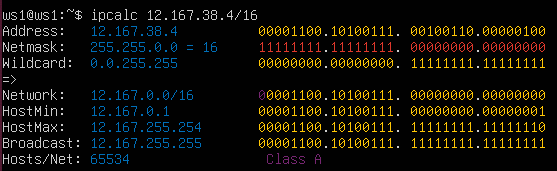
   3. `255.255.254.0 (= /23)` -> `HostMin = 12.167.38.1`; `HostMax = 12.167.39.254`
      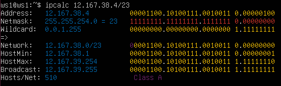
   4. `Маска /4` -> `HostMin = 0.0.0.1`; `HostMax = 15.255.255.254`
      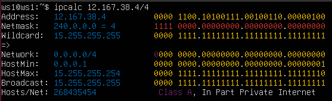

## 1.2 localhost

1) Можно ли обратиться к данным адресам:
   1. 194.34.23.100 -- нет
   2. 127.0.0.2 -- да
   3. 127.1.0.1 -- да
   4. 128.0.0.1 -- нет
   По причине `localhost` = 127.0.0.1/8, остальные не попадают в диапазон

## 1.3 Диапазоны и сегменты 

1) Заметим, что в `IPv4` частными считаются диапазоны `10.0.0.0 -- 10.255.255.255`, `172.16.0.0 -- 17.31.255.255`, `192.168.0.0 -- 192.168.255.255`. По этому диапазону распределым данные адреса
   <br>Частные IP:
    ```csv
            10.0.0.45
            192.168.4.2
            172.20.250.4
            172.16.255.255
            10.10.10.10
    ```
   <br>Публичные IP:
    ```csv
            134.43.0.2
            172.0.2.1
            192.172.0.1
            172.68.0.2
            192.169.168.1
    ```
2)
    Какие из IP могут быть шлюзом сети 10.10.0.0/18
    
    Проверяем диапазон:
    10.10.0.0 — 10.10.63.255

   | IP          | Может быть шлюзом? |
   | ----------- | ---------------- |
   | 10.0.0.1    | Нет              |
   | 10.10.0.2   | Да             |
   | 10.10.10.10 | Да             |
   | 10.10.100.1 | Нет            |
   | 10.10.1.255 | Да             |

# 2. Статическая маршрутизация между двумя машинами

WS1:
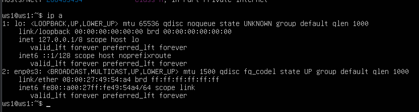

Опишем `/etc/netplan/00-installer-config.yaml`

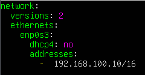

Применим и проверим результат `ip -4 a`

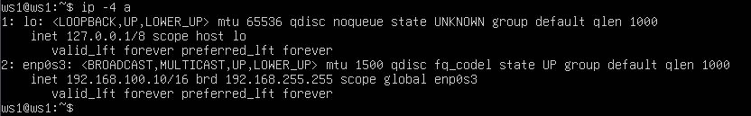

Теперь тоже самое для WS2 соответственно:

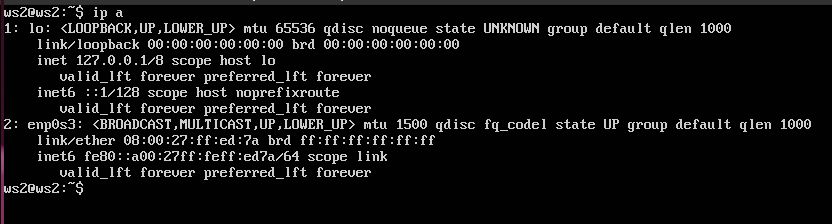

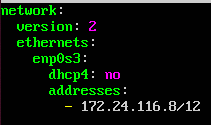

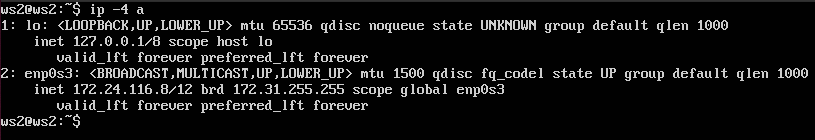

## 2.1
Добавим статический маршрут ws1 -> ws2

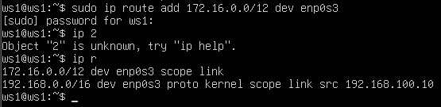

Аналогично ws2 -> ws1

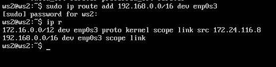


Пропингуем на обоих машинах:

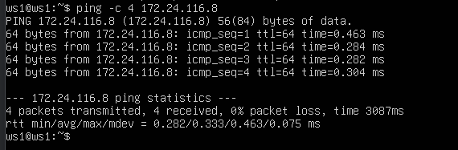

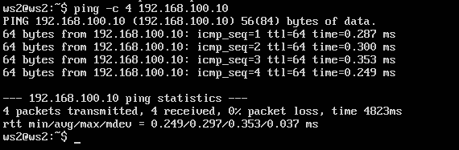

## 2.2 Статический маршрут с сохранением

Перезагрузим виртуалки. Для того чтобы руты оставались после перезагрузки, их нужно прописывать в 
`/etc/netplan/00-installer-config.yaml`. Сделаем это на ws1:

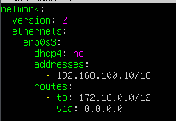

И на ws2:

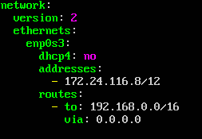

Пропингуем соединение между машинами

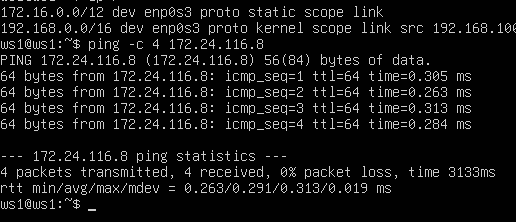

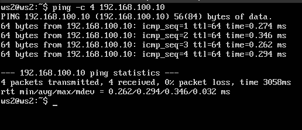

# 3. Iperf
1.Переведем единицы измерения:

8 Mbps = 1 MB/s  
100 MB/s = 800000 Kbps  
1 Gbps = 1000 Mbps  

2.Проверим скорость, для этого на ws1 запустим `iperf3 -s`, а с ws2 подключимся. 

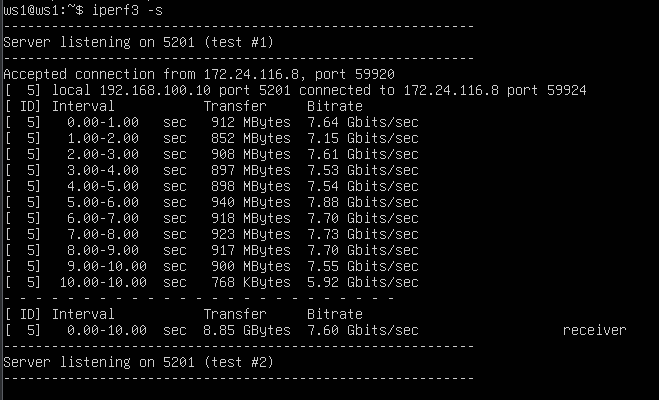

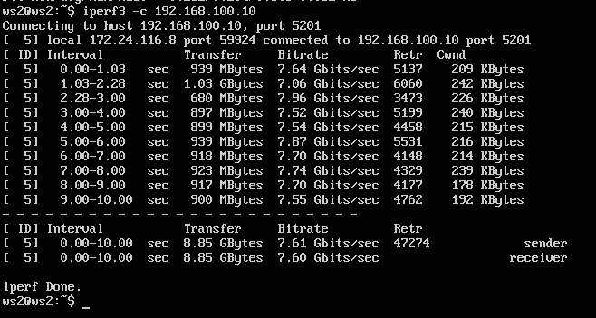

По скриншотам видно, что скорость -- `7.6 GiB/sec`

# 4. Сетевой экран

## 4.1

Пропишем правила на обоих машинах в `/etc/firewall.sh`

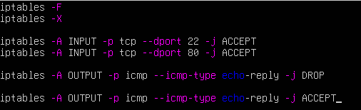

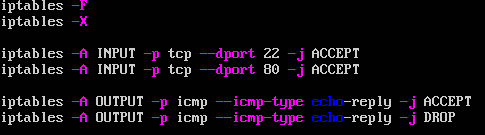

Запускаем их:


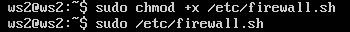

## 4.2

Пропингуем с обеих машин

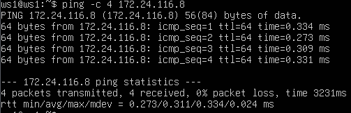

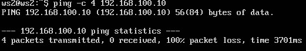

И того, пинг ws2 с ws1 — хост не отвечает из-за запрета echo-reply.
iptables идёт сверху вниз и применяет первое подходящее правило.

Теперь проверим что машиная живая с помощью nmap

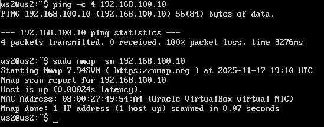

# 5. Статическая маршрутизация сети

Поднимем 5 виртуальных машин по диаграме и распределим их по сетям:

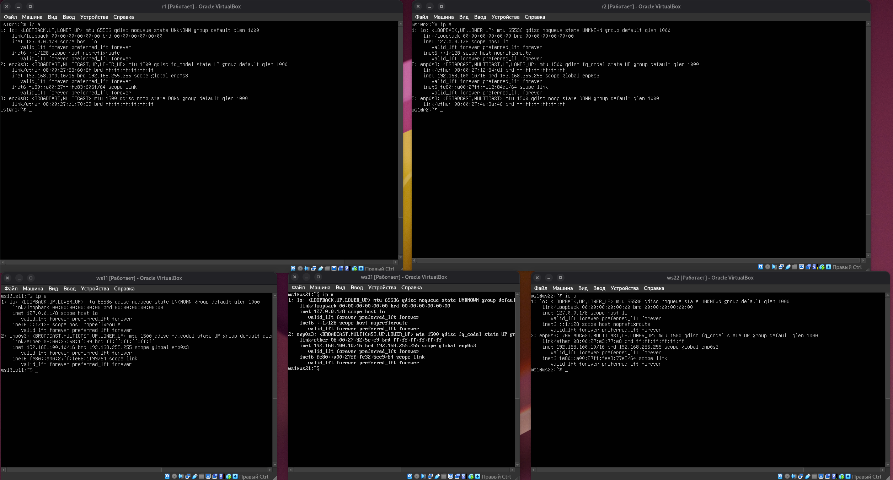

Теперь пропишем адреса для каждого из них:

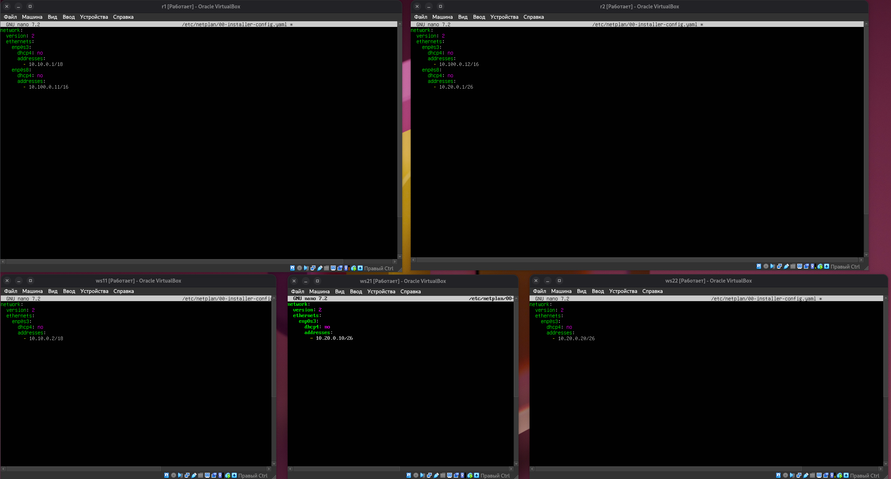

Применим все изменения нетплана:

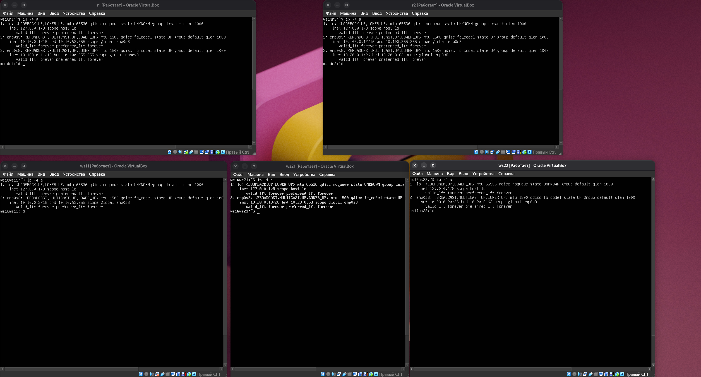


Пинг ws21-> ws22:

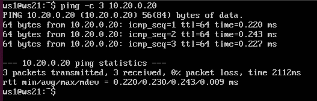

Пинг ws11 -> r1

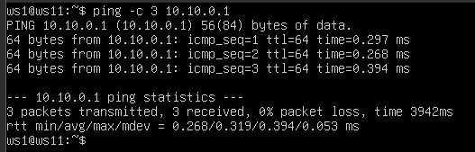

Пропишем переадресацию на роутерах:

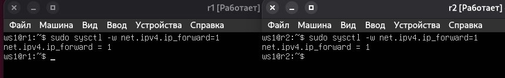

Также пропишем это в конфигурации чтобы работало после перезагрузки:

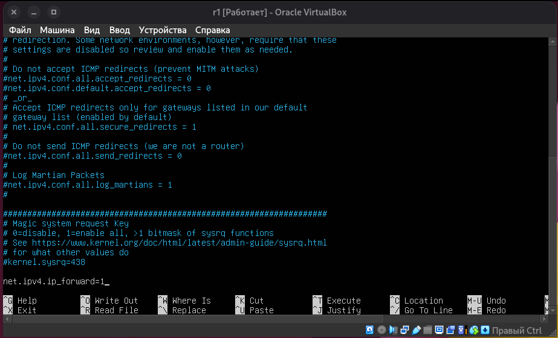

Настроим маршруты по умолчанию через роутеры на ws11, ws21, ws22

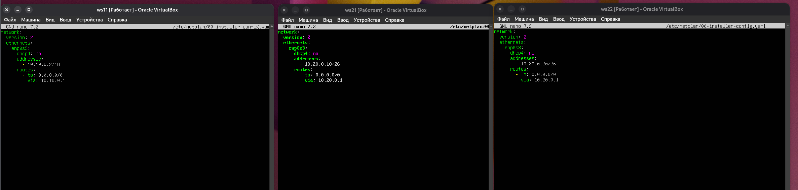

Применим изменения и проверим роуты

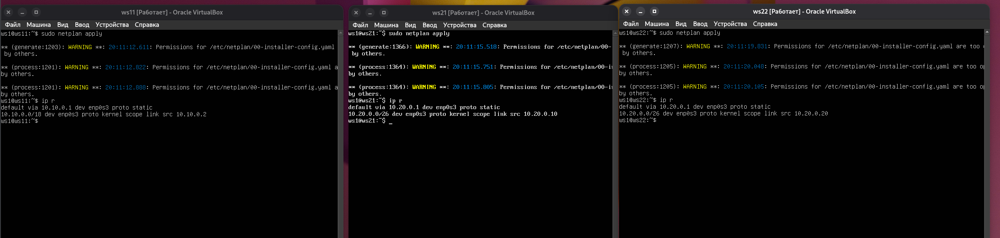

Пингуем с ws11 и на r2 через `tcpdump` слышим пинги:

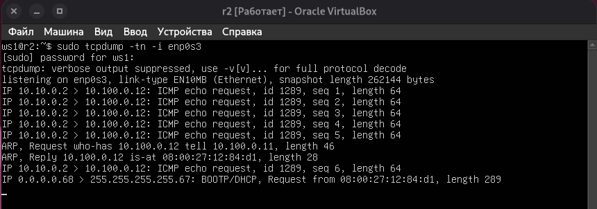

Теперь настроим на роутерах статические маршруты, и пропингуем уже всю сеть:

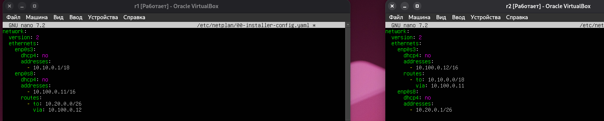

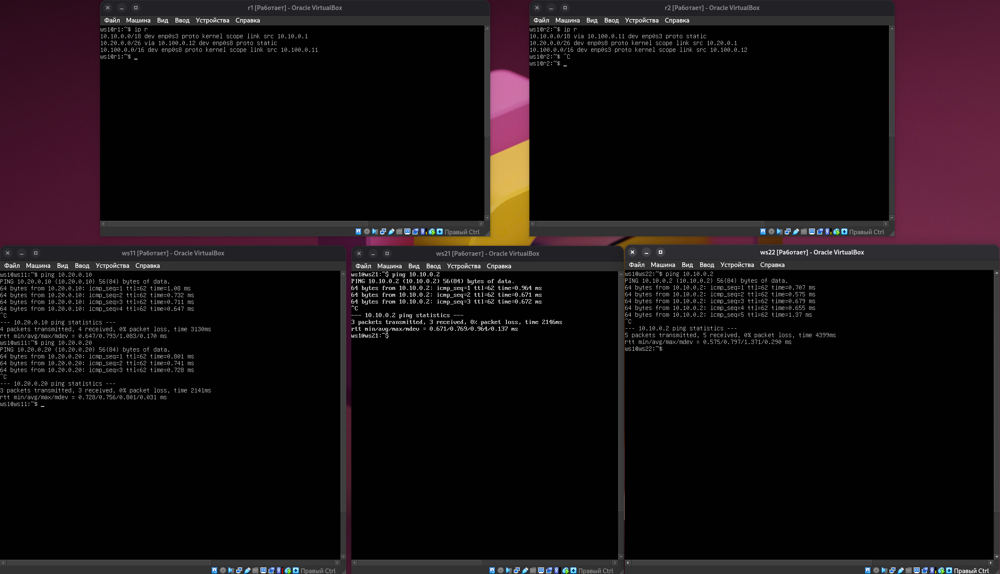

На скриншотах видно, что сеть доступна всем клиентам, и пинги идут успешно.

Дальше, проверим `ip r list` на `ws1`

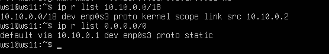

Маршрут 10.10.0.0/18 выбран вместо 0.0.0.0/0, потому что он более специфичен (маска длиннее), а в маршрутизации всегда используется маршрут с наибольшей длиной префикса.

Далее, запустим tcpdump на первом роутере и посмотрим `traceroute` от `ws1` к `ws2`

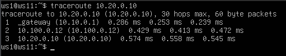

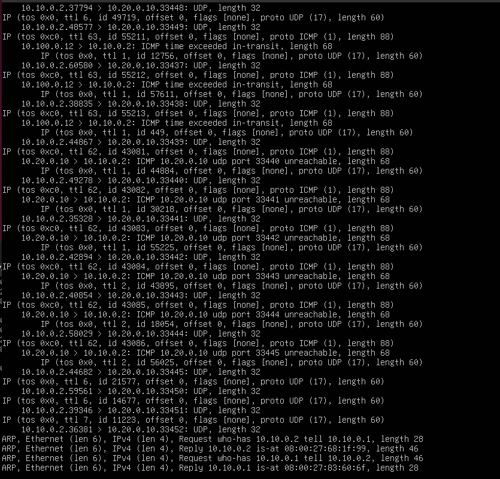

Traceroute отправляет серию ICMP-пакетов, постепенно увеличивая значение TTL (Time To Live):

Первый пакет отправляется с TTL = 1
→ первый роутер (r1) уменьшает TTL до 0 и отправляет ответ ICMP Time Exceeded

Второй пакет отправляется с TTL = 2
→ r1 пропускает, на r2 TTL обнуляется
→ r2 отправляет ICMP Time Exceeded

Третий пакет отправляется с TTL = 3
→ доходит до конечной машины (ws21), которая отвечает ICMP Echo Reply
Таким образом, traceroute определяет весь путь, потому что каждый роутер на маршруте отправляет ICMP Time Exceeded, когда TTL обнуляется.
Далее, попытаемся пропинговать несуществующий адрес с `ws11` и посмотрим как на это отреагирует роутер

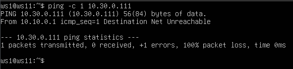

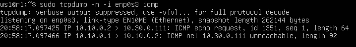

При попытке отправить ICMP Echo Request на несуществующий адрес 10.30.0.111, роутер r1 не может найти маршрут для этой сети и формирует ICMP-ответ типа Destination Unreachable.
Это сообщение отправляется обратно на ws11 и показывает, что конечная сеть или узел недоступны.
tcpdump на r1 подтверждает, что роутер генерирует ICMP-ошибку, когда не знает, куда перенаправить пакет.


# 6. Динамическая настройка IP с помощью DHCP

## 6.1
   Настроим DHCP на r2
   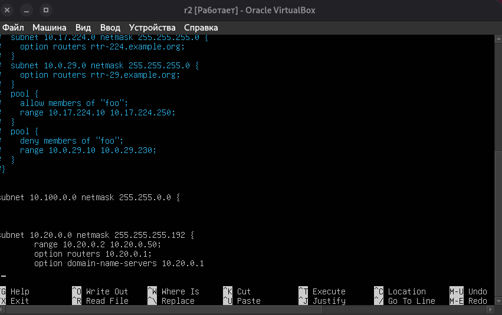
## 6.2

   Теперь настроим DNS (поменяем resolv.conf)

   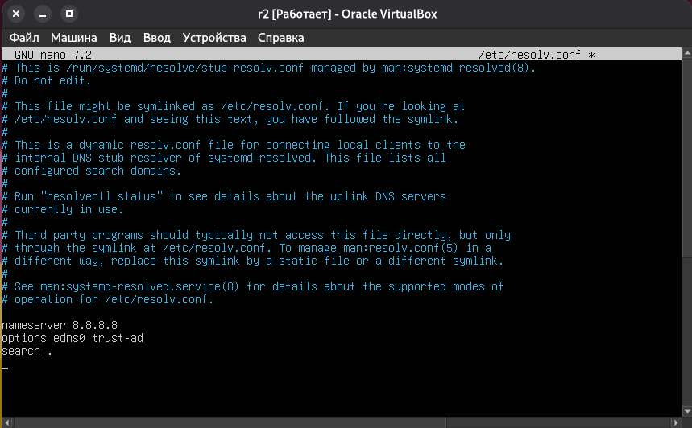

## 6.3
   Перезапустим сервис DHCP-сервера

   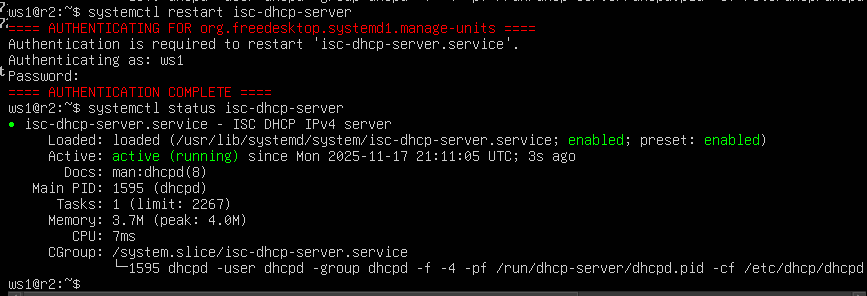

## 6.4 
   После ребута можно увидеть, что `ws21` получил новый, динамичекский ip, и он все еще пингует `ws22`

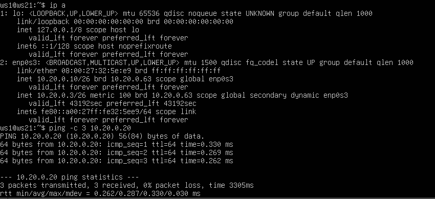


## 6.5

Привяжем DHCP по MAC на r1, Для этого настроим dhcp на r1, установим MAC `10:10:10:10:10:BA` на `ws11`, и запросим новый `ip` через DHCP по MAC

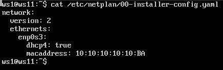
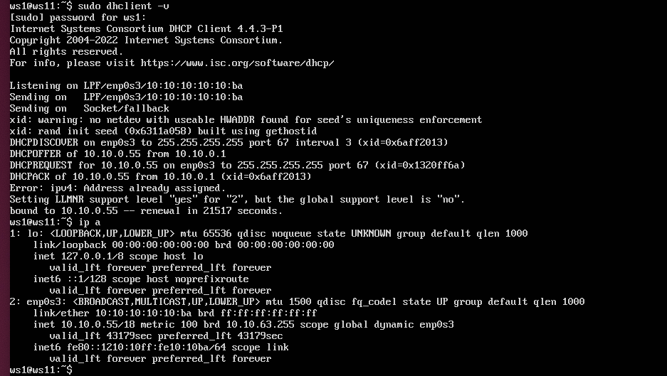


## Part 7. NAT
### 1. Настройка Apache2 на ws22 и r1

В файле `/etc/apache2/ports.conf` на ws22 изменяем строку:

`Listen 80` → `Listen 0.0.0.0:80`

В файле `/etc/apache2/ports.conf` на r1 изменяем такую же строку.

Далее, пропишем дроп всех пакетов на роутере 


Пропингуем, и убедимся что пинга нету 


Опять добавим правило, разрешающее `ICMP`


Пингуем:


Как видно, пинг идет, значит правило работает. 

Далее, включим `SNAT` и пропишем маршрутизацию, также `DNAT`


Запустим фаерволл и протестируем `telnet` на `ws22` и `r1`


## Part 8. SSH tunnel

Пропишем прослушку порта и включим `apache`


Попробуем подключится по `ssh`


SSH создаёт туннель с локального порта ws21 до удалённого ресурса ws22:80.
ws21 подключается к localhost:8081, и SSH перенаправляет трафик через r2 на ws22.
SSH создаёт порт на r2 (8082), который ведёт обратно в туннель к ws11, а затем на ws22:80.
r2 подключается к localhost:8082, и запрос попадает на ws22 через туннель.


